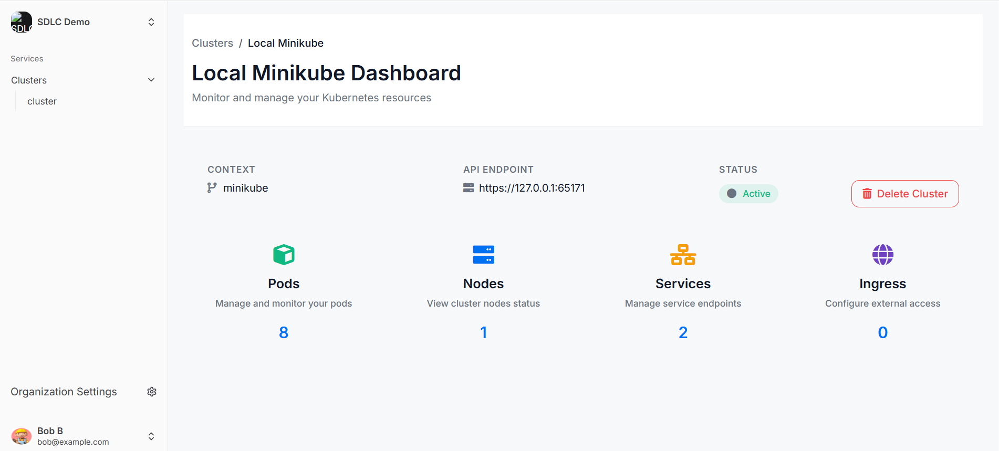
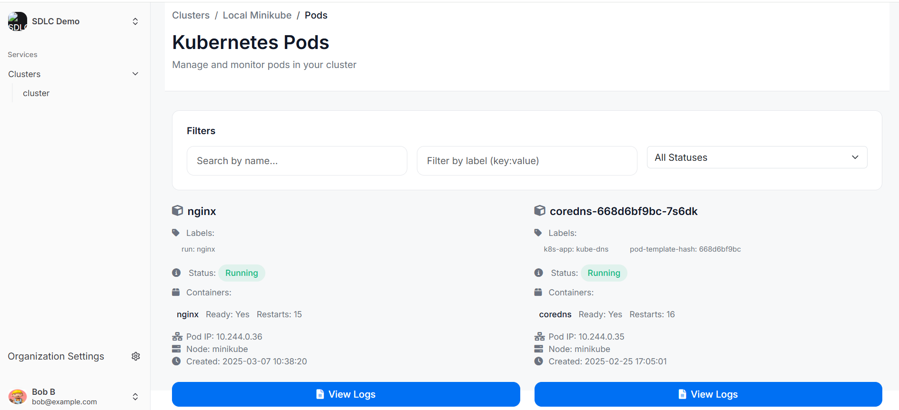

A minimalistic deployment monitor for your Kubernetes(K8s) cluster with logs search and sort functionality

do npm run build to get static files

Add following environment variables,

CLERK_SECRET_KEY=<YOUR_CLERK_SECRET> 
CLERK_PUBLISHABLE_KEY=<YOUR_CLERK_PUBLISHABLE> 
CLERK_FRONTEND_API_URL=<YOUR_CLERK_API> 
PARENT_URL=https://auth-layout.vercel.app/_next/static/chunks/remoteEntry.js 

Attaching UI Screenshots,

Home Page

K8s Services

Pod service

Searching the Pod Log

